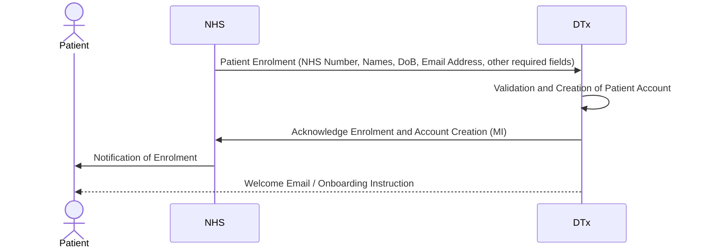
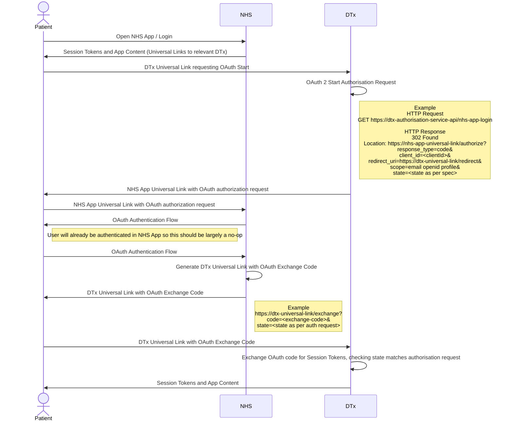
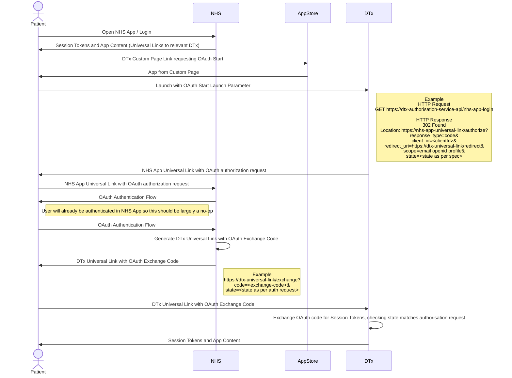

## Enrolment (NHS Instigated)

This diagram shows the high level sequence of events and communication involved in enroling a patient on a DTx

## DTx App Launch - Pre-installed

This is the sequence for when a patient already has the DTx app installed and they click on a link in the NHS App to launch the DTx App. It essentially uses a native equivalent of OAuth by opening links to the native apps with OAuth parameters, instead of links to the websites with OAuth parameters.  Initial investigation has shown this should be possible.

## DTx App Launch - SSO through Installation

This is the sequence for when a patient does not have the DTx app installed and they click on a link in the NHS App to launch the DTx App. 
It relies on a custom app page, which should theoretically be able to launch an app with a custom parameter, this being one which initiates the OAuth style communication as above.

