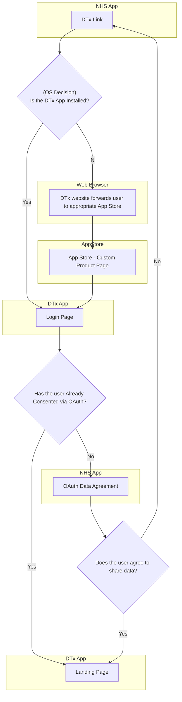

## Patient Launches DTx through NHS App 
1. Login to NHS App
2. View Connected Apps
3. Choose DTx and click link
4. OS decides if link is opened with web browser or app (depending on if the app is installed)
5. Flow A - App Installed
   1. Link opens DTx App
   2. DTx App launches NHS App 
   3. Patient (first time) sees OAuth agreement / scopes screen
   4. Aceeptance launches DTx App
   5.  DTx App is logged in and shows starting screens
6.  Flow B - App Not Installed
    1. Link opens a webpage in the user's browser which redirects to the App Store Page for the DTx App
    2. Patient downloads the DTx App
    3. Patient opens the DTx App
    4. The DTx App launches the NHS App 
    5. Patient (first time) sees OAuth agreement / scopes screen
    6.  Aceeptance launches DTx App
    7.  DTx App is logged in and shows starting screens

